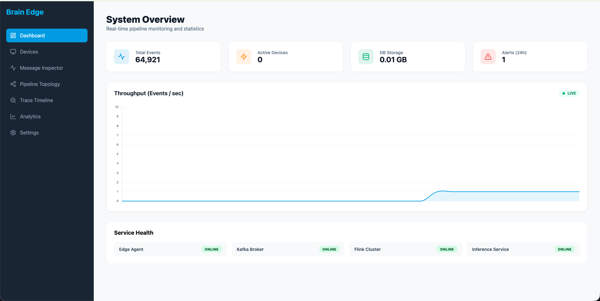
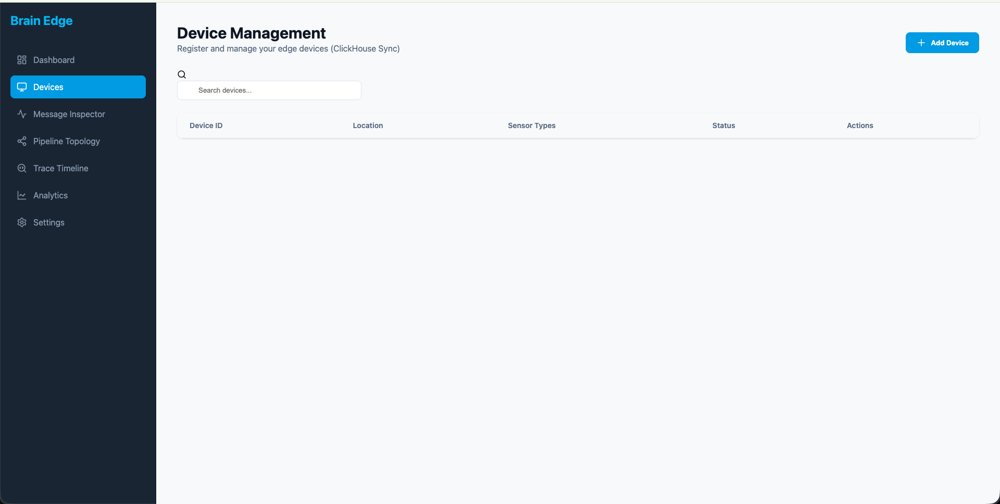
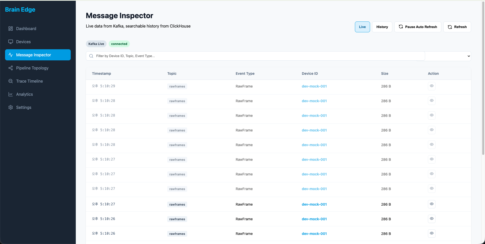
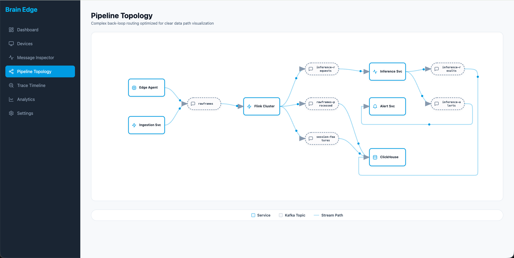
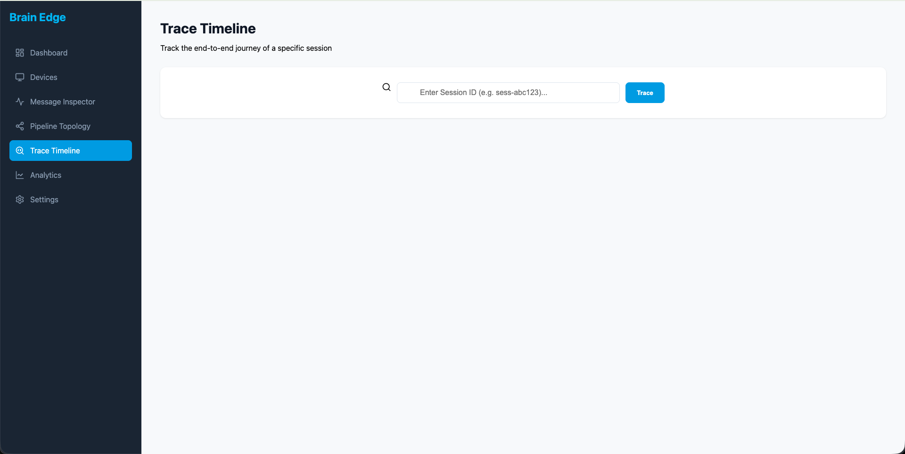
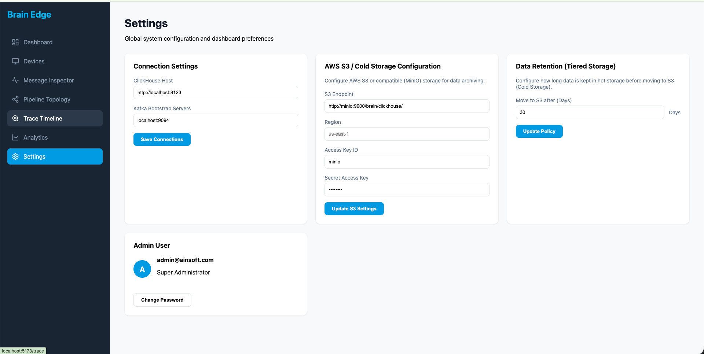

# IOT-BRAIN-EDGE

센서 이벤트를 엣지에서 수집하고 Kafka 스트리밍, ClickHouse 저장, 운영용 대시보드까지 연결하는 오픈소스 파이프라인입니다.

## 저장소 구성

- `proto/`: 공통 이벤트 스키마와 계약
- `core/`: 공통 도메인 코드와 유틸리티
- `edge-agent/`: 로컬 스풀, HTTP 모드, Kafka 모드를 지원하는 Pekko 기반 엣지 런타임
- `services/ingestion-service/`: HTTP 수집 API와 처리된 토픽의 ClickHouse 적재 담당
- `services/processor-service/`: `rawframes` 토픽을 읽어 ClickHouse에 저장하는 서비스
- `services/inference-service/`: Kafka 컨슈머와 REST API를 가진 Python 추론 서비스
- `services/alert-service/`: 알림 Kafka 토픽을 읽어 Webhook으로 전달하는 서비스
- `pipelines/flink-jobs/`: 세션화, 피처 추출, 집계, 추론 트리거용 Flink 잡
- `dashboard/`: SvelteKit 기반 운영 대시보드
- `deploy/`: Swarm 스택, ClickHouse 스키마, 스토리지 설정
- `docs/`: 아키텍처 및 운영 메모
- `notebooks/`: 예제 노트북 자산

## 현재 기본 실행 형태

현재 `deploy/swarm/stack.yml` 기준 기본 Swarm 스택에는 다음 서비스가 포함됩니다.

- Kafka
- Kafka UI
- MinIO
- ClickHouse
- `ingestion-service`
- `processor-service`
- dashboard
- notebook

반면 `inference-service`, `alert-service`, Flink 잡은 저장소에는 존재하지만, 현재 `make stack-up`에 포함되지는 않습니다. 필요 시 별도로 실행해야 합니다.

## 대시보드

관리 대시보드는 이제 API 중심 구조입니다.

- 브라우저가 Kafka나 ClickHouse에 직접 붙지 않음
- `dashboard/src/routes/api/` 아래 SvelteKit 서버 API가 단일 데이터 접근 계층 역할 수행
- `Message Inspector`는 하이브리드 구조:
  - `Live`: 서버 측 Kafka client 사용
  - `History`: 서버 API를 통한 ClickHouse 조회
- `Settings`는 서버 API를 통해 ClickHouse TTL과 S3 cold-storage 설정을 변경

### 화면 예시

**Dashboard**



**Devices**



**Message Inspector**



**Pipeline Topology**



**Trace Timeline**



**Settings**



## 데이터 흐름

### 1. HTTP 수집 경로

`edge-agent (HTTP 모드)` -> `ingestion-service /v1/ingest` -> Kafka `rawframes`

이 경로는 브리지 역할만 하며, ClickHouse에 직접 쓰지 않습니다.

### 2. Raw frame 저장 경로

Kafka `rawframes` -> `processor-service` -> ClickHouse `brain.rawframes`

### 3. 처리 완료 토픽 저장 경로

다음 Kafka 토픽:

- `rawframes-processed`
- `session-features`
- `inference-results`
- `inference-alerts`
- `env-features`
- `power-features`

은 `ingestion-service`가 소비해서 대응하는 ClickHouse 테이블에 저장합니다. 이 경로에는 재시도와 DLQ 처리 로직이 들어 있습니다.

### 4. 선택적 분석 경로

위 파생 토픽은 Flink 잡과 `inference-service`가 생성합니다. 관련 코드는 저장소에 있지만 현재 기본 스택에서는 수동/선택 실행입니다.

## 빠른 시작

### 전제 조건

- Docker with Swarm enabled
- `sbt`
- Python 3.9+ (`services/inference-service`용)

### 1. Swarm 초기화

```bash
docker swarm init
```

### 2. 필요한 경우 로컬 이미지 빌드

로컬 Docker에 서비스 이미지가 없으면 먼저 빌드합니다.

```bash
make build-ingest
make build-processor
```

### 3. 기본 스택 기동

```bash
make stack-up
```

이 명령은 Swarm 스택 배포와 ClickHouse 스키마 초기화를 함께 수행합니다.

### 4. Kafka 토픽 생성

현재 스택에서는 Kafka 자동 토픽 생성 기능이 꺼져 있으므로 명시적으로 생성해야 합니다.

```bash
make create-kafka-topics
```

### 5. 데이터 생성

HTTP 모드:

```bash
make run-edge-http
```

Kafka 모드:

```bash
make run-edge-kafka
```

### 6. UI 접속

```bash
make dashboard-ui
make kafka-ui
make clickhouse-ui
make notebook-ui
```

기본 주소:

- Dashboard: `http://localhost:5173`
- Kafka UI: `http://localhost:8089`
- ClickHouse HTTP: `http://localhost:8123`
- Notebook: `http://localhost:8888?token=brain`

## 자주 쓰는 명령

### 스택과 스키마

```bash
make stack-up
make stack-down
make stack-ps
make ch-init
```

### Kafka 토픽

```bash
make create-kafka-topics
make topic-list
```

### 로컬 서비스 실행

```bash
make run-ingest
make run-processor
make run-alert
make run-edge-http
make run-edge-kafka
```

### 로그 확인

```bash
make logs-kafka
make logs-kafka-ui
make logs-clickhouse
make logs-notebook
```

## 파이프라인 검증

ClickHouse row 수 확인:

```bash
curl -s "http://localhost:8123/?query=SELECT%20count()%20FROM%20brain.rawframes" && echo
curl -s "http://localhost:8123/?query=SELECT%20count()%20FROM%20brain.session_features" && echo
curl -s "http://localhost:8123/?query=SELECT%20count()%20FROM%20brain.inference_results" && echo
curl -s "http://localhost:8123/?query=SELECT%20count()%20FROM%20brain.inference_alerts" && echo
```

최근 rawframes 확인:

```bash
make ch-tail
```

## Flink 및 Inference

저장소에는 Flink 잡과 Python inference 서비스가 그대로 포함되어 있습니다.

Flink 잡 로컬 실행:

```bash
sbt "project flinkJobs" test
make run-flink JOB=sessionizer
make run-flink JOB=feature-base
make run-flink JOB=inference-trigger
```

Python inference 서비스 실행:

```bash
cd services/inference-service
pip install -r requirements.txt
uvicorn main:app --reload --port 8090
```

유용한 환경 변수:

```bash
export INFERENCE_KAFKA_BOOTSTRAP_SERVERS=localhost:9094
export INFERENCE_REQUESTS_TOPIC=inference-requests
export INFERENCE_RESULTS_TOPIC=inference-results
export INFERENCE_ALERTS_TOPIC=inference-alerts
export MODEL_VERSION=brain-v1-stable
export INFERENCE_ALERT_THRESHOLD=0.8
```

## ClickHouse Storage 및 TTL

현재 대시보드 `Settings` 페이지는 다음 항목을 관리합니다.

- `rawframes`, `session_features`, `inference_results`, `inference_alerts`, `env_features`, `power_features`의 TTL
- `deploy/clickhouse/config/storage.xml`에 기록되는 S3 호환 cold-storage 설정

설정 변경 후 서버는 `SYSTEM RELOAD CONFIG`를 호출해 ClickHouse 설정을 다시 읽게 합니다.

## 추가 문서

- [아키텍처](docs/architecture.md)
- [운영 상태 및 남은 과제](docs/issues.md)
